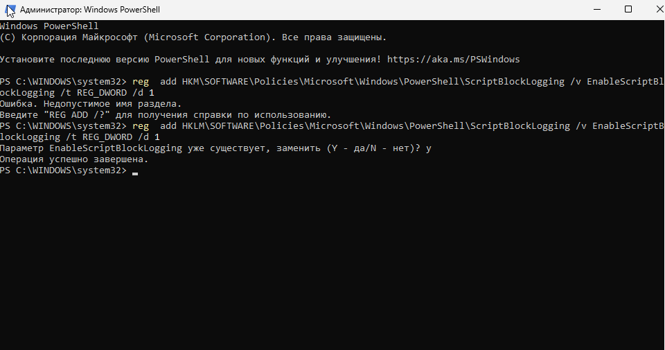
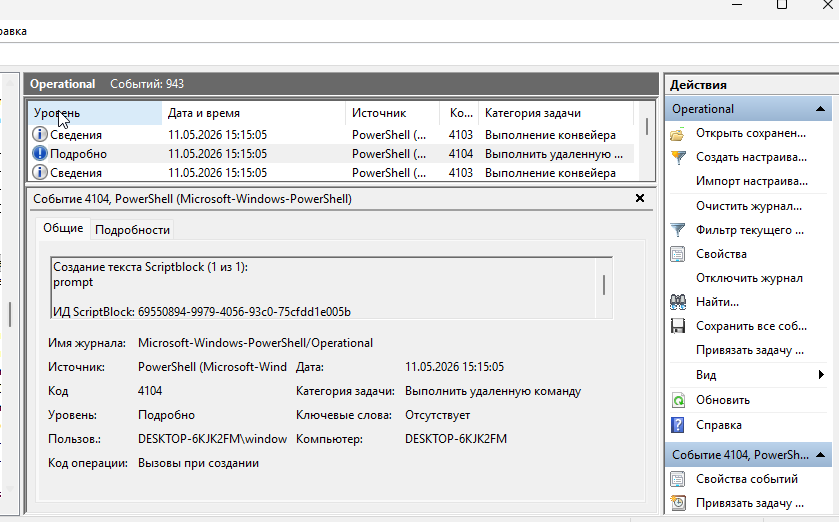
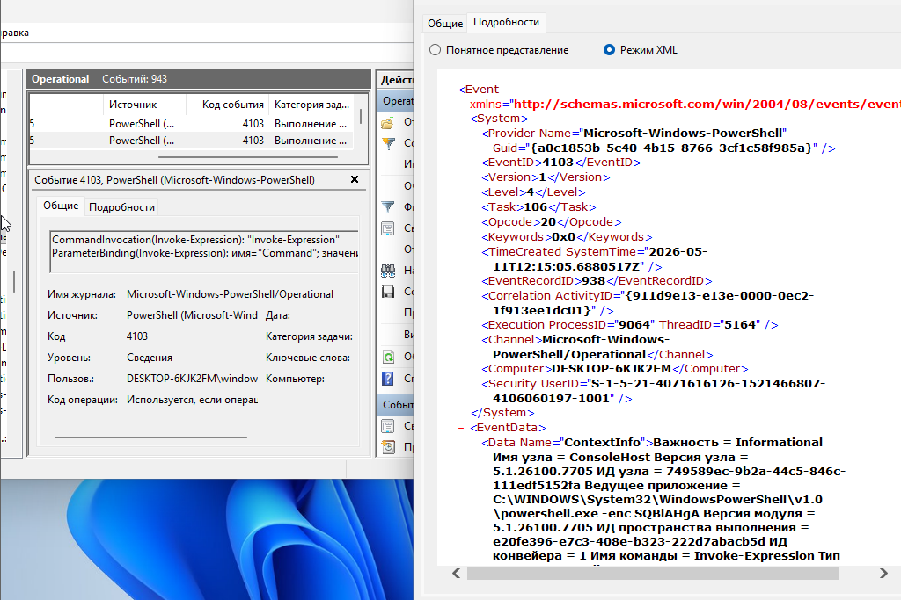

# PowerShell Logging Lab

## Goal

Detect suspicious PowerShell activity using Windows Event Logs.

---

# Environment

| Component | Value |
|---|---|
| OS | Windows 11 |
| Logs | Microsoft-Windows-PowerShell/Operational |
| Tool | Event Viewer |

---

# 1. Enable Script Block Logging

```powershell
HKLM\SOFTWARE\Policies\Microsoft\Windows\PowerShell\ScriptBlockLogging
```

```powershell
EnableScriptBlockLogging = 1
```



---

# 2. Execute Encoded PowerShell

```powershell
powershell -enc SQB1AHgA
```


---

# 3. Analyze Logs

| Event ID | Purpose |
|---|---|
| 4103 | Module logging |
| 4104 | Script block logging |





---

# IOC

| Indicator | Description |
|---|---|
| `powershell.exe` | PowerShell execution |
| `-enc` | Encoded command |
| `Invoke-Expression` | Suspicious execution |
| `4103` | Module logging |
| `4104` | Script block logging |

---

# XML Analysis

Reviewed raw XML event data.


---

# MITRE ATT&CK

| Technique | ID |
|---|---|
| PowerShell | T1059.001 |
| Obfuscated Files | T1027 |
